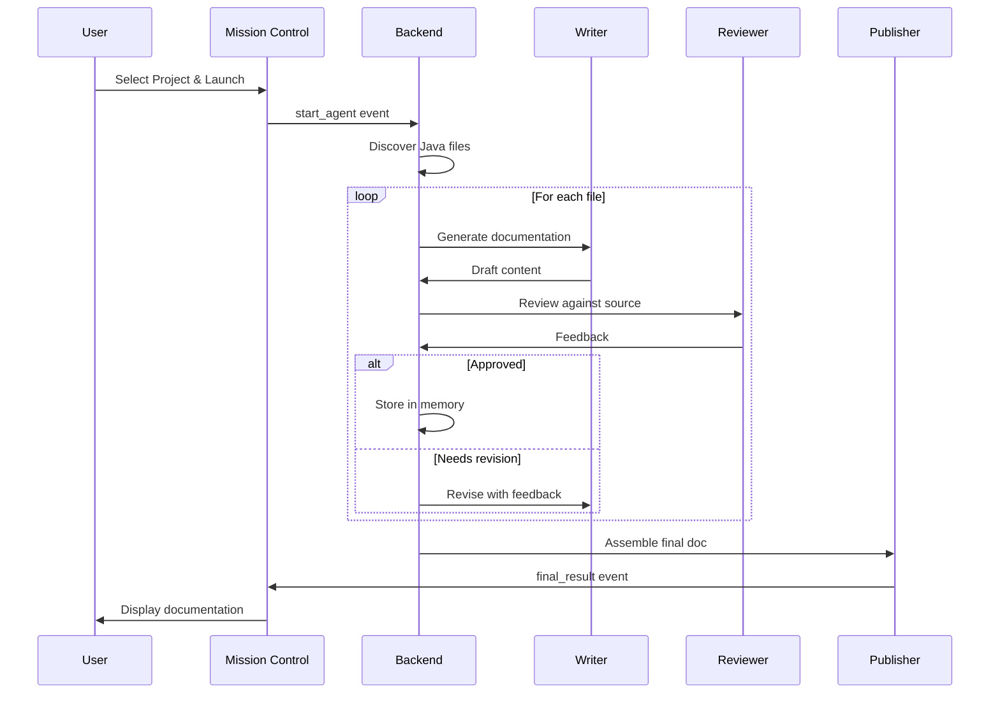

# Autonomous Spring Boot Documentation Agent

<div align="center">
  
  ### 🤖 AI-Powered Multi-Agent Documentation System
  
  *Automatically generate comprehensive technical documentation for Spring Boot projects with real-time monitoring*
  
  [](https://choosealicense.com/licenses/mit/)
  [](https://www.python.org/downloads/)
  [](https://nodejs.org/)
  [](CONTRIBUTING.md)
  [](CODE_OF_CONDUCT.md)

  [Features](#-features) •
  [Demo](#-demo) •
  [Installation](#-installation) •
  [Usage](#-usage) •
  [Contributing](#-contributing) •
  [License](#-license)

</div>

---

## 📋 Table of Contents

- [Overview](#-overview)
- [Features](#-features)
- [Demo](#-demo)
- [Architecture](#-architecture)
- [Installation](#-installation)
  - [Prerequisites](#prerequisites)
  - [Quick Start](#quick-start)
  - [Detailed Setup](#detailed-setup)
- [Usage](#-usage)
- [Configuration](#-configuration)
- [Project Structure](#-project-structure)
- [Tech Stack](#-tech-stack)
- [Contributing](#-contributing)
- [Roadmap](#-roadmap)
- [Troubleshooting](#-troubleshooting)
- [FAQ](#-faq)
- [License](#-license)
- [Acknowledgments](#-acknowledgments)
- [Contact](#-contact)

---

## 🎯 Overview

The **Autonomous Spring Boot Documentation Agent** is an intelligent system that eliminates the manual effort of writing and maintaining technical documentation. Using a multi-agent AI architecture, it analyzes Java Spring Boot codebases, generates comprehensive documentation, and validates accuracy through peer review—all while providing real-time visibility into the process.

### Why This Project?

- ⏰ **Save Time**: Automate hours of documentation work
- 🎯 **Ensure Accuracy**: AI agents cross-validate content against source code
- 👁️ **Full Visibility**: Watch the documentation process in real-time
- 🔒 **Privacy First**: Runs 100% locally on your machine
- 🎨 **Professional Output**: Generates well-structured Markdown with proper formatting

---

## ✨ Features

### Core Capabilities

- 🧠 **Multi-Agent Collaboration**
  - Writer Agent creates documentation sections
  - Reviewer Agent validates against source code
  - Publisher Agent assembles the final document

- 🖥️ **Mission Control Desktop UI**
  - Native desktop application (Tauri + Next.js)
  - Real-time agent activity feed
  - Live documentation preview
  - One-click download and copy

- 🔐 **Local-First Architecture**
  - No cloud dependencies for code analysis
  - Secure local file system access
  - API keys stored locally

- 🤖 **Intelligent Analysis**
  - Automatic Spring Boot project structure detection
  - Entity, Service, Controller, and Repository analysis
  - Dependency relationship mapping
  - Code pattern recognition

- 📝 **Comprehensive Output**
  - Table of contents with deep linking
  - Code snippets with syntax highlighting
  - Architecture diagrams (Mermaid.js)
  - API endpoint documentation
  - Database schema documentation

- 🔄 **Robust & Resilient**
  - Vector store for long-term memory
  - Automatic retry logic for API failures
  - Progress persistence across runs
  - Graceful error handling

---

## 🏗️ Architecture

### System Overview

```mermaid
graph TB
    subgraph "Desktop UI (Tauri + Next.js)"
        UI[Mission Control Interface]
        Feed[Agent Activity Feed]
        Preview[Documentation Preview]
    end
    
    subgraph "Backend (FastAPI + LangGraph)"
        API[REST API + WebSocket]
        Orchestrator[Agent Orchestrator]
        Writer[Writer Agent]
        Reviewer[Reviewer Agent]
        Publisher[Publisher Agent]
    end
    
    subgraph "Services"
        LLM[Gemini 1.5 Pro]
        Vector[ChromaDB Vector Store]
        FS[File System]
    end
    
    UI -->|WebSocket| API
    API --> Orchestrator
    Orchestrator --> Writer
    Writer --> Reviewer
    Reviewer --> Publisher
    Writer <-->|Queries| LLM
    Reviewer <-->|Queries| LLM
    Writer <-->|Memory| Vector
    Orchestrator <-->|Read Files| FS
    
    style UI fill:#2d3748,stroke:#4299e1,stroke-width:2px
    style API fill:#2d3748,stroke:#48bb78,stroke-width:2px
    style LLM fill:#2d3748,stroke:#ed8936,stroke-width:2px
```



### Agent Workflow



---

## 🚀 Installation

### Prerequisites

Before you begin, ensure you have the following installed:

| Requirement | Version | Download Link |
|------------|---------|---------------|
| **Python** | 3.11+ | [python.org](https://www.python.org/downloads/) |
| **Node.js** | 18+ | [nodejs.org](https://nodejs.org/) |
| **Rust** | Latest stable | [rustup.rs](https://rustup.rs/) |
| **Git** | Latest | [git-scm.com](https://git-scm.com/) |

#### Platform-Specific Requirements

**macOS:**
```bash
xcode-select --install
```

**Linux (Ubuntu/Debian):**
```bash
sudo apt update
sudo apt install libwebkit2gtk-4.0-dev \
    build-essential \
    curl \
    wget \
    libssl-dev \
    libgtk-3-dev \
    libayatana-appindicator3-dev \
    librsvg2-dev
```

**Windows:**
- Install [Microsoft Visual C++ Redistributable](https://aka.ms/vs/17/release/vc_redist.x64.exe)
- Install [WebView2](https://developer.microsoft.com/en-us/microsoft-edge/webview2/#download-section)

For detailed Tauri setup instructions, visit the [official Tauri prerequisites guide](https://tauri.app/v1/guides/getting-started/prerequisites).

### Quick Start

```bash
# 1. Clone the repository
git clone https://github.com/SOUHAIB-IA/springboot-doc-agent.git
cd springboot-doc-agent

# 2. Run the setup script
chmod +x setup.sh
./setup.sh

# 3. Configure environment variables
cp .env.example .env
# Edit .env and add your GOOGLE_API_KEY

# 4. Start the application
npm run start:all
```

### Detailed Setup

#### 1. Clone the Repository

```bash
git clone https://github.com/SOUHAIB-IA/springboot-doc-agent.git
cd springboot-doc-agent
```

#### 2. Backend Setup

```bash
# Create virtual environment
python -m venv .venv

# Activate virtual environment
# On macOS/Linux:
source .venv/bin/activate
# On Windows:
.venv\Scripts\activate

# Install dependencies
pip install -r requirements.txt
```

#### 3. Frontend Setup

```bash
# Navigate to frontend directory
cd springboot-doc-agent-frontend

# Install dependencies
npm install

# Return to project root
cd ..
```

#### 4. Environment Configuration

Create a `.env` file in the project root:

```bash
cp .env.example .env
```

Edit `.env` and configure:

```env
# Required: Google Gemini API Key
GOOGLE_API_KEY=your_gemini_api_key_here

# Optional: Server Configuration
HOST=0.0.0.0
PORT=8000

# Optional: LLM Configuration
LLM_TEMPERATURE=0.3
LLM_MAX_TOKENS=8192

# Optional: Vector Store Path
VECTOR_STORE_PATH=./data/chroma_db
```

**Getting a Gemini API Key:**
1. Visit [Google AI Studio](https://makersuite.google.com/app/apikey)
2. Sign in with your Google account
3. Click "Create API Key"
4. Copy the key to your `.env` file

---

## 📖 Usage

### Starting the Application

You have two options:

#### Option 1: Using the Convenience Script (Recommended)

```bash
npm run start:all
```

This starts both the backend and frontend in separate processes.

#### Option 2: Manual Start (Two Terminals)

**Terminal 1 - Backend:**
```bash
source .venv/bin/activate  # Windows: .venv\Scripts\activate
python main.py
```

**Terminal 2 - Frontend:**
```bash
cd springboot-doc-agent-frontend
npm run tauri dev
```

### Using the Application

1. **Launch**: The Mission Control window opens automatically
2. **Select Project**: Click "Browse for Project..." and select your Spring Boot project root
3. **Launch Agent**: Click "Launch Agent" to start the documentation process
4. **Monitor**: Watch real-time agent activity in the feed
5. **Review**: Once complete, review the documentation in the preview panel
6. **Export**: Click "Download" or "Copy to Clipboard"

### Command Line Options

```bash
# Start with custom port
python main.py --port 8080

# Enable debug logging
python main.py --debug

# Use different LLM provider
python main.py --llm openai --api-key YOUR_KEY
```

---

## ⚙️ Configuration

### LLM Provider Configuration

The system supports multiple LLM providers. Edit `config/llm_config.py`:

```python
# Google Gemini (Default)
LLM_PROVIDER = "gemini"
LLM_MODEL = "gemini-1.5-pro"

# OpenAI
# LLM_PROVIDER = "openai"
# LLM_MODEL = "gpt-4-turbo-preview"

# Groq
# LLM_PROVIDER = "groq"
# LLM_MODEL = "mixtral-8x7b-32768"
```

### Agent Behavior

Customize agent prompts in `agents/prompts/`:
- `writer_prompt.txt` - Documentation writing guidelines
- `reviewer_prompt.txt` - Review criteria and standards
- `publisher_prompt.txt` - Final assembly instructions

### Vector Store Configuration

Modify `config/vector_store_config.py` for memory settings:

```python
VECTOR_STORE_CONFIG = {
    "persist_directory": "./data/chroma_db",
    "embedding_model": "sentence-transformers/all-MiniLM-L6-v2",
    "collection_name": "spring_boot_docs",
    "chunk_size": 1000,
    "chunk_overlap": 200
}
```

---

## 📁 Project Structure

```
springboot-doc-agent/
├── agents/                      # Agent definitions
│   ├── writer_agent.py
│   ├── reviewer_agent.py
│   ├── publisher_agent.py
│   └── prompts/
├── config/                      # Configuration files
│   ├── llm_config.py
│   └── vector_store_config.py
├── springboot-doc-agent-frontend/  # Frontend application
│   ├── src/
│   │   ├── app/                 # Next.js app
│   │   ├── components/          # React components
│   │   └── lib/                 # Utilities
│   ├── src-tauri/               # Tauri backend
│   │   ├── src/
│   │   └── tauri.conf.json
│   ├── package.json
│   └── next.config.js
├── tools/                       # Agent tools
│   ├── file_system_tools.py
│   └── memory_tools.py
├── utils/                       # Utilities
│   ├── file_discovery.py
│   └── code_parser.py
├── tests/                       # Test suite
│   ├── test_agents.py
│   └── test_tools.py
├── data/                        # Runtime data
│   └── chroma_db/
├── main.py                      # Backend entry point
├── requirements.txt             # Python dependencies
├── .env.example                 # Environment template
├── .gitignore
├── LICENSE
├── README.md
├── CONTRIBUTING.md
├── CODE_OF_CONDUCT.md
└── CHANGELOG.md
```

---

## 🛠️ Tech Stack

### Backend

| Technology | Purpose | Documentation |
|-----------|---------|---------------|
| **Python 3.11+** | Core language | [python.org](https://www.python.org/) |
| **FastAPI** | REST API & WebSocket server | [fastapi.tiangolo.com](https://fastapi.tiangolo.com/) |
| **LangChain** | LLM orchestration framework | [langchain.com](https://www.langchain.com/) |
| **LangGraph** | Multi-agent workflow | [langchain-ai.github.io/langgraph](https://langchain-ai.github.io/langgraph/) |
| **ChromaDB** | Vector database | [trychroma.com](https://www.trychroma.com/) |
| **Sentence Transformers** | Local embeddings | [sbert.net](https://www.sbert.net/) |
| **python-socketio** | WebSocket communication | [python-socketio.readthedocs.io](https://python-socketio.readthedocs.io/) |

### Frontend

| Technology | Purpose | Documentation |
|-----------|---------|---------------|
| **Next.js 14** | React framework | [nextjs.org](https://nextjs.org/) |
| **React 18** | UI library | [react.dev](https://react.dev/) |
| **TypeScript** | Type safety | [typescriptlang.org](https://www.typescriptlang.org/) |
| **Tauri** | Desktop app framework | [tauri.app](https://tauri.app/) |
| **Tailwind CSS** | Styling | [tailwindcss.com](https://tailwindcss.com/) |
| **shadcn/ui** | Component library | [ui.shadcn.com](https://ui.shadcn.com/) |
| **socket.io-client** | WebSocket client | [socket.io](https://socket.io/) |

### AI/ML

| Provider | Model | Use Case |
|---------|-------|----------|
| **Google Gemini** | gemini-1.5-pro | Default LLM |
| **OpenAI** | gpt-4-turbo | Alternative LLM |
| **Groq** | mixtral-8x7b | High-speed inference |

---

## 🤝 Contributing

We love contributions! Whether you're fixing bugs, adding features, or improving documentation, your help is welcome.

### How to Contribute

1. **Fork the repository**
2. **Create a feature branch** (`git checkout -b feature/AmazingFeature`)
3. **Commit your changes** (`git commit -m 'Add some AmazingFeature'`)
4. **Push to the branch** (`git push origin feature/AmazingFeature`)
5. **Open a Pull Request**

### Contribution Guidelines

Please read our [Contributing Guide](CONTRIBUTING.md) for:
- Code style and conventions
- Commit message format
- Testing requirements
- PR submission process

### Areas for Contribution

We're especially looking for help with:

#### 🔧 Features & Enhancements
- [ ] Support for additional LLM providers (Anthropic Claude, local models)
- [ ] Database schema visualization
- [ ] REST API endpoint testing and documentation
- [ ] Dependency analysis from `pom.xml`/`build.gradle`
- [ ] Multi-language support (Python/Django, Node.js/Express, Go)
- [ ] Automated diagram generation (class diagrams, sequence diagrams)

#### 🎨 UI/UX Improvements
- [ ] Dark/light theme toggle
- [ ] Project history and comparison viewer
- [ ] Configuration editor in UI
- [ ] Progress indicators and ETAs
- [ ] Keyboard shortcuts

#### 🧪 Testing & Quality
- [ ] Unit tests for agents
- [ ] Integration tests for workflows
- [ ] E2E tests for UI
- [ ] Performance benchmarking
- [ ] Load testing for large codebases

#### 📚 Documentation
- [ ] Video tutorials
- [ ] Architecture decision records (ADRs)
- [ ] API reference documentation
- [ ] Troubleshooting guides
- [ ] Localization (i18n)

### Development Setup

```bash
# Install development dependencies
pip install -r requirements-dev.txt
cd springboot-doc-agent-frontend && npm install

# Run tests
pytest tests/
npm test

# Run linters
black .
pylint agents/ tools/ utils/
npm run lint

# Run type checking
mypy agents/ tools/ utils/
npm run type-check
```

### Code of Conduct

This project adheres to a [Code of Conduct](CODE_OF_CONDUCT.md). By participating, you're expected to uphold this code.

---

## 🗺️ Roadmap

### Version 1.1 (Q1 2025)
- [x] Multi-agent documentation system
- [x] Real-time UI monitoring
- [x] Vector store integration
- [ ] Project history tracking
- [ ] Export to PDF/HTML

### Version 1.2 (Q2 2025)
- [ ] Multi-LLM provider support
- [ ] Configuration UI panel
- [ ] Database schema documentation
- [ ] API endpoint testing
- [ ] Performance optimizations

### Version 2.0 (Q3 2025)
- [ ] Support for Python/Django projects
- [ ] Support for Node.js/Express projects
- [ ] Automated diagram generation
- [ ] Collaborative editing
- [ ] Cloud sync option (optional)

### Future Considerations
- [ ] IDE plugins (VS Code, IntelliJ)
- [ ] CI/CD integration
- [ ] Documentation versioning
- [ ] Custom template support
- [ ] Enterprise features

See our [GitHub Projects](https://github.com/SOUHAIB-IA/springboot-doc-agent/projects) for detailed planning.

---

## 🔧 Troubleshooting

### Common Issues

#### Backend won't start

**Problem**: `ModuleNotFoundError: No module named 'fastapi'`

**Solution**:
```bash
source .venv/bin/activate
pip install -r requirements.txt
```

#### Frontend build fails

**Problem**: `Error: Cannot find module 'next'`

**Solution**:
```bash
cd springboot-doc-agent-frontend
rm -rf node_modules package-lock.json
npm install
```

#### Tauri build fails on Linux

**Problem**: Missing system dependencies

**Solution**:
```bash
sudo apt-get update
sudo apt-get install -y libwebkit2gtk-4.0-dev \
    build-essential \
    curl \
    wget \
    libssl-dev \
    libgtk-3-dev \
    libayatana-appindicator3-dev \
    librsvg2-dev
```

#### API key not recognized

**Problem**: `GOOGLE_API_KEY not found`

**Solution**:
1. Ensure `.env` file exists in project root
2. Verify the key is properly formatted: `GOOGLE_API_KEY=your_key_here`
3. Restart the backend server

#### WebSocket connection fails

**Problem**: Frontend can't connect to backend

**Solution**:
1. Verify backend is running on port 8000
2. Check firewall settings
3. Ensure `HOST=0.0.0.0` in `.env`

### Getting Help

- 📖 Check our [FAQ](#-faq)
- 💬 Join our [Discussions](https://github.com/SOUHAIB-IA/springboot-doc-agent/discussions)
- 🐛 Open an [Issue](https://github.com/SOUHAIB-IA/springboot-doc-agent/issues)
- 📧 Email: sohaib.garaaaouch55@gmail.com

---

## ❓ FAQ

**Q: Does this work with other Java frameworks?**  
A: Currently optimized for Spring Boot, but can be adapted for other frameworks with custom prompts.

**Q: Can I use this offline?**  
A: The app runs locally, but requires internet for LLM API calls. Local model support is planned.

**Q: How much does it cost?**  
A: The software is free. You only pay for LLM API usage (Gemini offers a free tier).

**Q: Is my code sent to the cloud?**  
A: Only code snippets are sent to the LLM API for analysis. You control what's shared.

**Q: Can I customize the documentation format?**  
A: Yes! Edit the agent prompts in `agents/prompts/` to change output style.

**Q: What size codebases can it handle?**  
A: Tested with projects up to 100k lines. Performance varies with LLM API speed.

---

## 📄 License

This project is licensed under the MIT License - see the [LICENSE](LICENSE) file for details.

```
MIT License

Copyright (c) 2025 souhaib garaaouch

Permission is hereby granted, free of charge, to any person obtaining a copy
of this software and associated documentation files (the "Software"), to deal
in the Software without restriction, including without limitation the rights
to use, copy, modify, merge, publish, distribute, sublicense, and/or sell
copies of the Software, and to permit persons to whom the Software is
furnished to do so, subject to the following conditions:

The above copyright notice and this permission notice shall be included in all
copies or substantial portions of the Software.

THE SOFTWARE IS PROVIDED "AS IS", WITHOUT WARRANTY OF ANY KIND, EXPRESS OR
IMPLIED, INCLUDING BUT NOT LIMITED TO THE WARRANTIES OF MERCHANTABILITY,
FITNESS FOR A PARTICULAR PURPOSE AND NONINFRINGEMENT. IN NO EVENT SHALL THE
AUTHORS OR COPYRIGHT HOLDERS BE LIABLE FOR ANY CLAIM, DAMAGES OR OTHER
LIABILITY, WHETHER IN AN ACTION OF CONTRACT, TORT OR OTHERWISE, ARISING FROM,
OUT OF OR IN CONNECTION WITH THE SOFTWARE OR THE USE OR OTHER DEALINGS IN THE
SOFTWARE.
```

---

## 🙏 Acknowledgments

This project builds upon incredible open-source technologies:

- [LangChain](https://github.com/langchain-ai/langchain) - LLM application framework
- [Tauri](https://github.com/tauri-apps/tauri) - Desktop app framework
- [FastAPI](https://github.com/tiangolo/fastapi) - Modern Python web framework
- [Next.js](https://github.com/vercel/next.js) - React framework
- [ChromaDB](https://github.com/chroma-core/chroma) - Vector database
- [shadcn/ui](https://github.com/shadcn-ui/ui) - Beautiful UI components

Special thanks to:
- Google for the Gemini API
- The open-source community for countless libraries and tools
- All contributors who help improve this project

---

## 📞 Contact

**Project Maintainer**: [souhaib garaaouch](https://github.com/SOUHAIB-IA/Springboot_documentation_agent)

- 📧 Email: sohaib.garaaouch55@gmail.com
- 💼 LinkedIn: [souhaib garaaouch](https://www.linkedin.com/in/souhaib-garaaouch-853a011a5/)

<div align="center">

### ⭐ Star this repository if you find it helpful!

**Made with ❤️ by the open-source community**

[⬆ Back to Top](#autonomous-spring-boot-documentation-agent)

</div>